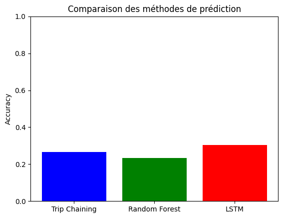
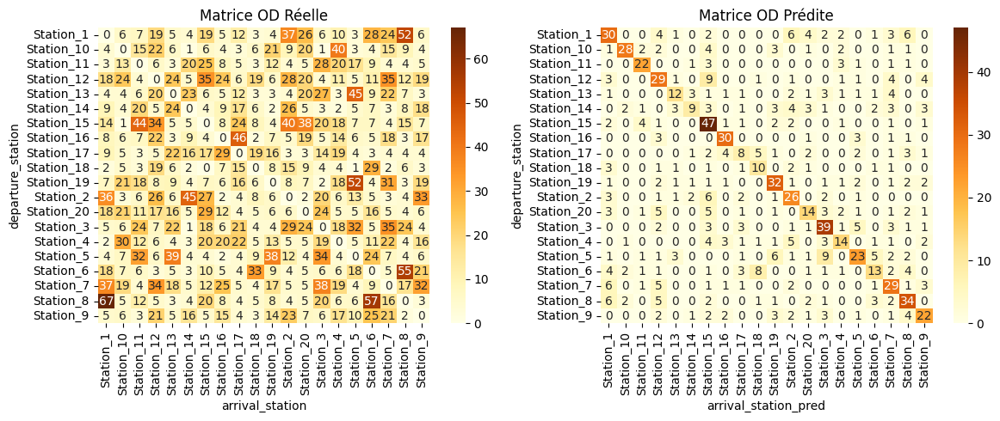
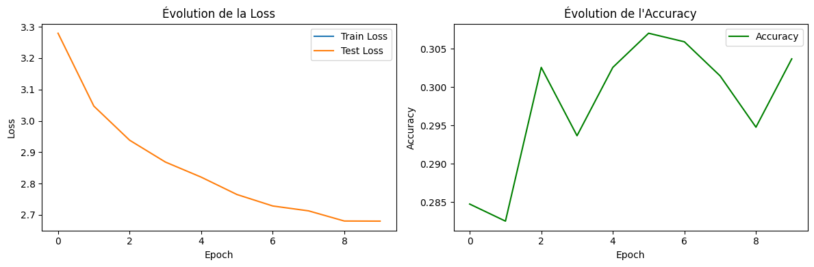
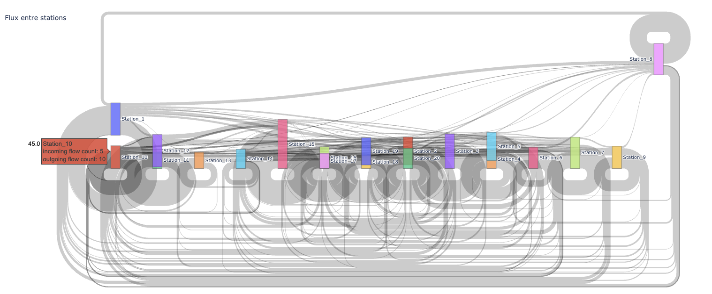
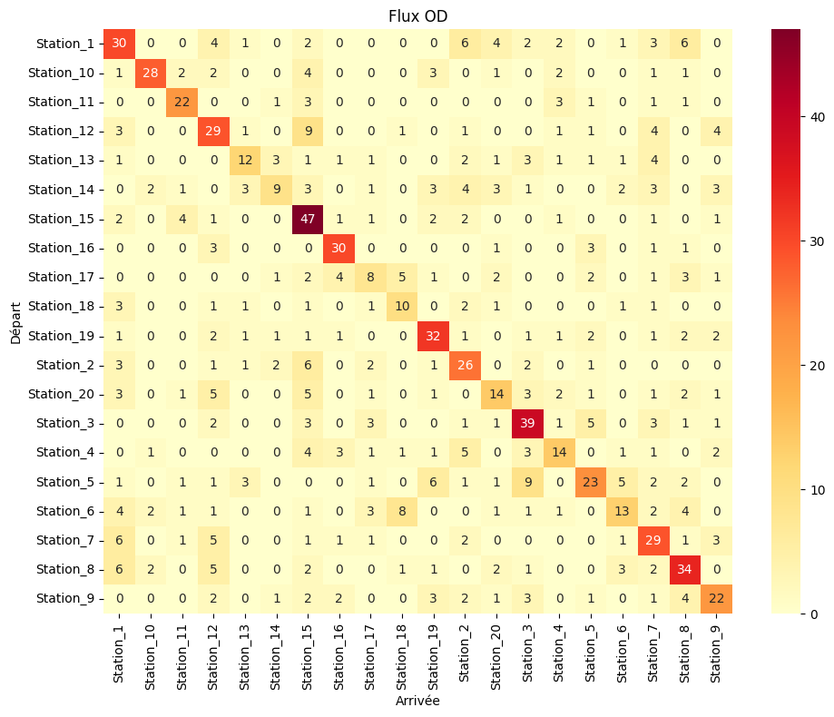

# Prédiction des stations de sortie dans un réseau de vélos en libre-service

**Objectif** : Prédire la station de retour d’un vélo en libre-service à partir des données historiques de trajets, puis générer une matrice origine-destination et visualiser les flux.

## Structure
```
arretVelo_Predict/
├── data/                   # Jeux de données
└── images/                 # images resultat
└── models/                 # Modele sauvegardé
└── output/                 # Sortie de flux entre station
└── veloArretPredict.ipynb  # code python
└── requirements.txt        # Dépendances python
```

## Installation

1. **Cloner le dépôt** :
   ```bash
   git clone https://github.com/foxsudo/arretVelo_Predict.git
   cd arretVelo_Predict
   ```
2. **Installez les dépendances** :
   ```bash
   pip install -r requirements.txt
   ```

## Méthodologie

1. **Préparation des Données**

    - Nettoyage des trajets aberrants
    - Encodage des stations en IDs numériques
    - Création de séquences temporelles pour le LSTM

2. **Modélisation**

    - Modèle LSTM (PyTorch) pour capturer les dépendances temporelles
    - Comparaison avec :

        - Trip Chaining (méthode heuristique)
        - Random Forest (baseline)

    

3. **Analyse des Résultats**

    - Matrice Origine-Destination (OD)
    
    - Courbes d'apprentissage (loss/accuracy)
    
    - Benchmark des méthodes

## Visualisations

**A. Flux entre Stations**
- Diagramme de Sankey (Plotly) : Flux prédits entre stations
 
- Heatmap Interactive :
 